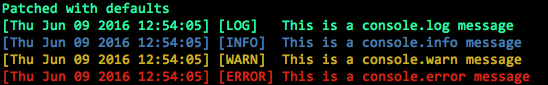

# console-stripe

[![npm][npm-image]][npm-url]
[![downloads][downloads-image]][downloads-url]

[npm-image]: https://img.shields.io/npm/v/console-stripe.svg?style=flat-square
[npm-url]: https://npmjs.org/package/console-stripe
[downloads-image]: https://img.shields.io/npm/dm/console-stripe.svg?style=flat-square
[downloads-url]: https://npmjs.org/package/console-stripe

This module enables you to patch the console's methods in Node.js, to add timestamp prefix based on a given string pattern, and more...

This is just å copy of [Console-stamp](https://npmjs.org/package/console-stamp), but without the colors, which in this module is based on the type of message. 
`error` is red, `warn` is yellow and `info` is blue. The rest has no color. 

## Usage ##

### Install

	npm install console-stripe

### Example 

```
require( "console-stamp" )( console );
```

